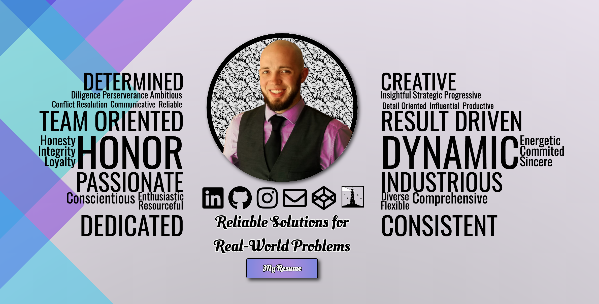
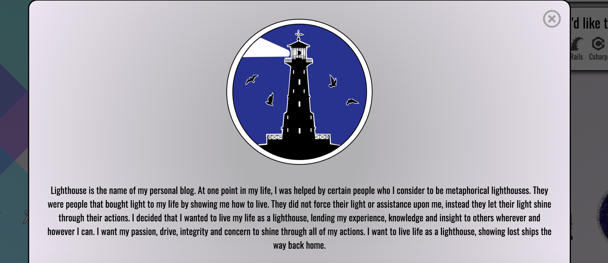
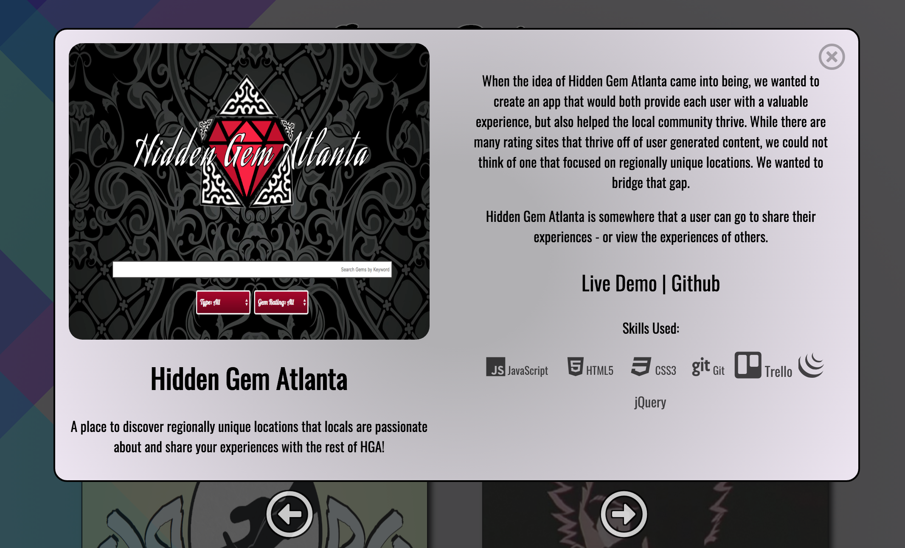
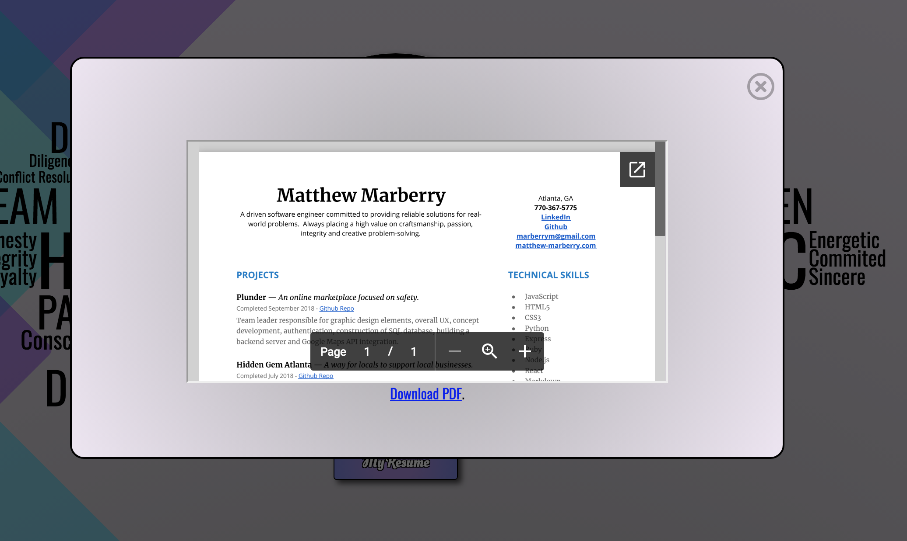
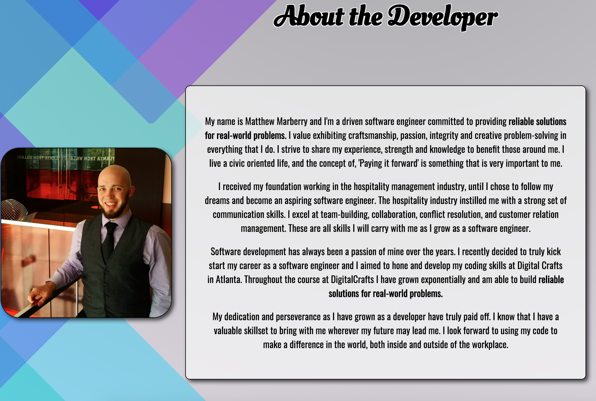

# **My Portfolio Site**
###  **A journey into selling myself online.**
### [My Live Portfolio][1]

   
## Goals
 This portfolio has been a very interesting project for me to work on.  It has been an opportunity for me to both showcase my skills and also build my online presence and identity.  When building this website, I had two main components I wanted to focus on:
 ###### 1.  Portfolio Landing Page
  * I wanted a page that showcased both my programing skills and my abilities in regards to front-end design.
  * I wanted a page that accurately conveyed who I am as a person and the things that I value.
  * I also wanted a section dedicated to showcasing my skills as a graphic designer.
 ###### 2.  Building a Blog to Link to from my Landing Page
  * I wanted a blog that looked beautiful aesthetically with a name and message that suited me.
  * I wanted to have a blog that focused on some key areas of my life:
     * Coding - A place where I can document my journey into developing myself as a software engineer.
     * Lifestyle - A place where I can share my personal lifestyle and views with others in a constructive manner.
     * Projects - A place where I can showcase current projects I am working on, both inside and outside of tech.
     * Resume - Another place where I can showcase my resume and receive feedback on it.
     * About - A page where I could share with others my views behind LHM and why I believe in that cause.
     
     
## Design Inspiration for Portfolio

When beginning with the design of my portfolio, I started with the picture I wanted to use as a headshot.  I studied this image for a while and thought of ways that I could edit it to make it flow nicely within a portfolio.  I started by looking at the color and the content of the picture.  I saw that with some photo manipulation I could crop this image into a circle with a new background, I could also embellish the color of my shirt a little bit to make it more workable with an overall design scheme.  

I begin planning out my design theme.  I wanted my theme to make use of white space, but also utilize colors which matched the shirt in the picture.  I chose to go with a design that featured various shades of blues, pastel greens, and purples in order to complement the shirt.  I then counter balanced the design with light gray gradient with a small amount of variation.  The design I chose was a series of opaque CSS squares that were rotated and translated off the page with a fixed position.  This made the design universal as the user scrolls.

Next I thought about the content I wanted surrounding my head portfolio picture.  I decided to make a variation of a word cloud.  I wanted the cloud to feature all characteristic traits that I value and possess.  I also wanted to feature my personal slogan, **"Reliable Solutions for Real-World Problems,"** as well as access to my social media accounts, resume and contact information.

I ended up creating a head section of my portfolio that I felt accurately conveyed me as a person.  Shared my values.  Included symmetry as a design element.

Having a symmetrical design element to my portfolio was important to me, because symmetry and balance are both important aspects my personal and professional lives.  Symmetry and balance also heavily influenced the development of my personal logo which is featured on my portfolio as well. 

Throughout my portfolio I make use of modal boxes quite a bit.  I use them to show off my resume, projects as well as graphic design skills.  I worked hard to develop interesting transitional animations for each of the modals.
* The resume modal comes down from the top of the screen.
* The project modals come down from the top and can be scrolled to both the right and the left using javascript.
* The graphic design modal extends from the bottom of the screen.

  

The main portion of my profile is broken into two different segments:

1.  Project Section
   * Features all of my current projects.
   * Provides some insight on my role in the projects.
   * Links to the github.
   * Links to a Live Demo if available.
   * Features a video of the app in action.  (A work in progress :D)

2.  About the Developer Section:
   * Features the original head shot.
   * A section telling the user more about me and my journey into software engineering.
   * A section that lists out all of skills based on three categories:
      1.  What I'm currently working on learning.
      2.  What I currently know.
      3.  What I'd like to learn.

I thought this skills section was very important because I wanted to share not only what I have experience with, but what I'm continuing to work towards learning and what I would like to learn in the future.  I wanted to offer aid to recruiters and prospective employers in matching me with a position that matches my skillset and offers opportunities to gain further technological experience with technologies I'm interested in.

   

The last section of my portfolio was very important for me to convey.  Even though it is at the bottom of the page, it is far from the least important section.  This section features all of my recent graphic design work.  Upon clicking on one of the images, the user can learn more about the inspiration behind that particular design.  This section was important to me because I wanted to demonstrate my creativity and versatility in regards to front-end development.

In the end, I felt I developed a design and brand that suits me as my person.  I worked hard to bring craftsmanship, personality and personal identity to all aspects of the design and ended up being very happy with the result.

## Challenges
### Coming soon!
      
[1]: https://www.matthew-marberry.com